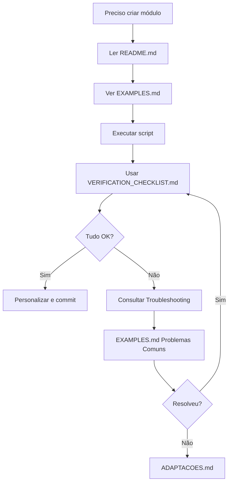
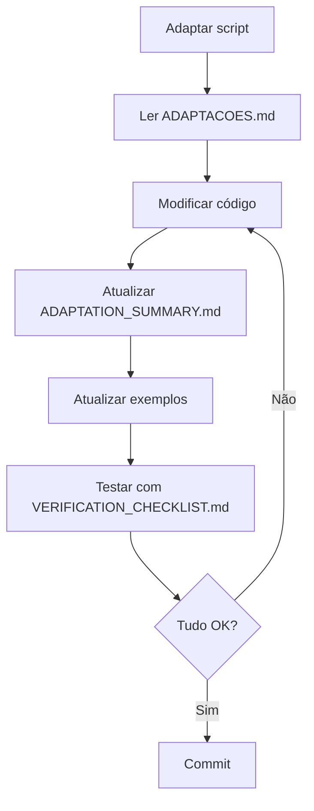

# 📚 Documentação - Scripts de Geração este projeto

Índice de toda a documentação disponível para o sistema de geração de módulos.

---

## 🚀 Início Rápido

**Novo no projeto?** Comece aqui:

1. 📖 [README.md](./README.md) - Visão geral e uso básico
2. 📝 [EXAMPLES.md](./EXAMPLES.md) - Exemplos práticos de uso
3. ✅ [VERIFICATION_CHECKLIST.md](./VERIFICATION_CHECKLIST.md) - O que verificar após gerar

---

## 📖 Documentação Completa

### 🎯 Guias de Uso

#### [README.md](./README.md)

- Visão geral dos scripts disponíveis
- Como executar o gerador
- Lista de arquivos gerados
- Link para documentação completa

#### [EXAMPLES.md](./EXAMPLES.md)

- 5 exemplos práticos de uso
- Casos de uso comuns (cadastros, sistema, auth)
- Respostas passo a passo
- Dicas e boas práticas
- Solução de problemas comuns

---

### 🔧 Documentação Técnica

#### [ADAPTACOES.md](./ADAPTACOES.md)

**Documentação mais completa - Leia para entender tudo!**

- Todas as mudanças feitas no script original
- Comparação: Original vs este projeto
- Diferenças de estrutura de pastas
- Imports corrigidos
- Configurações adaptadas
- Guia completo de uso
- Troubleshooting

#### [ADAPTATION_SUMMARY.md](./ADAPTATION_SUMMARY.md)

- Resumo executivo das mudanças
- Checklist do que foi alterado
- Tabela comparativa
- Como testar as adaptações
- Próximos passos opcionais

---

### ✅ Qualidade e Verificação

#### [VERIFICATION_CHECKLIST.md](./VERIFICATION_CHECKLIST.md)

- Checklist pós-geração
- Verificações automáticas
- Verificações manuais
- Testes funcionais
- Solução de problemas
- Personalizações recomendadas

---

## 🗂️ Organização por Necessidade

### "Quero usar o script agora!"

1. [README.md](./README.md) - Como executar
2. [EXAMPLES.md](./EXAMPLES.md) - Ver exemplo que se aplica ao seu caso
3. [VERIFICATION_CHECKLIST.md](./VERIFICATION_CHECKLIST.md) - Verificar se deu certo

### "Quero entender o que mudou"

1. [ADAPTACOES.md](./ADAPTACOES.md) - Guia completo de mudanças
2. [ADAPTATION_SUMMARY.md](./ADAPTATION_SUMMARY.md) - Resumo rápido

### "Estou com problemas"

1. [EXAMPLES.md](./EXAMPLES.md) - Seção "Problemas Comuns"
2. [ADAPTACOES.md](./ADAPTACOES.md) - Seção "Troubleshooting"
3. [VERIFICATION_CHECKLIST.md](./VERIFICATION_CHECKLIST.md) - Seção "Solução de Problemas"

### "Quero contribuir/melhorar"

1. [ADAPTATION_SUMMARY.md](./ADAPTATION_SUMMARY.md) - Seção "Próximos Passos"
2. [ADAPTACOES.md](./ADAPTACOES.md) - Entender a estrutura completa

---

## 📁 Estrutura da Documentação

```
scripts/
├── README.md                      ← Início
├── INDEX.md                       ← Este arquivo
├── EXAMPLES.md                    ← Exemplos práticos
├── ADAPTACOES.md          ← Guia completo (PRINCIPAL)
├── ADAPTATION_SUMMARY.md          ← Resumo técnico
├── VERIFICATION_CHECKLIST.md      ← Checklist pós-geração
│
├── generate-module-new.mjs        ← Script principal
│
└── core/                          ← Utilitários e templates
    ├── constants/
    │   └── paths.js               ← Caminhos do projeto
    ├── config-ops/
    │   └── presets.js             ← Atualizadores de config
    ├── file-ops/
    │   └── file-writer.js         ← Criação de arquivos
    ├── prompts/
    │   └── input-handler.js       ← Perguntas interativas
    ├── string-utils/
    │   └── transformers.js        ← Conversões de texto
    └── templates/
        ├── react/                 ← Templates React/TSX
        │   ├── feature.js
        │   ├── table.js
        │   ├── table-columns.js
        │   ├── form-modal.js
        │   ├── editar-modal.js
        │   ├── excluir-modal.js
        │   └── page-protected.js
        └── typescript/            ← Templates TS
            ├── types.js
            ├── constants.js
            └── module-utils.js
```

---

## 🎯 Fluxo de Trabalho Recomendado

### Para Desenvolvedores



### Para Mantenedores



---

## 📊 Estatísticas da Documentação

- **Total de arquivos:** 6 documentos
- **Páginas (aprox):** ~40 páginas
- **Exemplos práticos:** 5
- **Checklists:** 3 completas
- **Seções de troubleshooting:** 3

---

## 🔗 Links Rápidos

| Preciso de...     | Arquivo                                                  |
| ----------------- | -------------------------------------------------------- |
| Usar o script     | [README.md](./README.md)                                 |
| Ver exemplos      | [EXAMPLES.md](./EXAMPLES.md)                             |
| Entender mudanças | [ADAPTACOES.md](./ADAPTACOES.md)         |
| Resumo técnico    | [ADAPTATION_SUMMARY.md](./ADAPTATION_SUMMARY.md)         |
| Verificar módulo  | [VERIFICATION_CHECKLIST.md](./VERIFICATION_CHECKLIST.md) |
| Este índice       | [INDEX.md](./INDEX.md)                                   |

---

## 💡 Dicas

### Para Aprendizado

1. Leia na ordem: README → EXAMPLES → ADAPTACOES
2. Use EXAMPLES.md como referência durante o uso
3. Mantenha VERIFICATION_CHECKLIST.md aberto ao gerar

### Para Consulta Rápida

- **Esqueci comando:** README.md
- **Esqueci perguntas:** EXAMPLES.md
- **Deu erro:** Procure em "Problemas Comuns" nos 3 guias
- **Quero personalizar:** VERIFICATION_CHECKLIST.md seção 11

### Para Manutenção

- Ao mudar código, atualize ADAPTATION_SUMMARY.md
- Ao adicionar features, adicione em EXAMPLES.md
- Ao corrigir bugs, adicione em "Problemas Comuns"

---

## 📞 Suporte

1. **Consulte a documentação** nesta ordem:
   - EXAMPLES.md (Problemas Comuns)
   - ADAPTACOES.md (Troubleshooting)
   - VERIFICATION_CHECKLIST.md (Solução de Problemas)

2. **Ainda com problemas?**
   - Verifique se seguiu todos os passos do VERIFICATION_CHECKLIST.md
   - Compare com um módulo funcionando
   - Verifique logs do console

3. **Encontrou um bug?**
   - Documente o erro
   - Adicione à seção "Problemas Comuns"
   - Faça um pull request

---

## 🎓 Aprenda Mais

### Entenda a Arquitetura

- [core/README.md](./core/README.md) - Estrutura dos utilitários
- [core/templates/](./core/templates/) - Como funcionam os templates

### Personalize

- Edite templates em `core/templates/`
- Adicione novos transformers em `core/string-utils/`
- Crie presets personalizados em `core/config-ops/`

---

**Última atualização:** Adaptação para este projeto  
**Versão:** 1.0.0  
**Mantido por:** Equipe de Desenvolvimento
